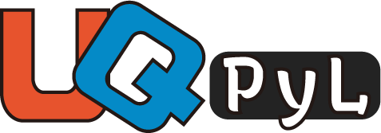
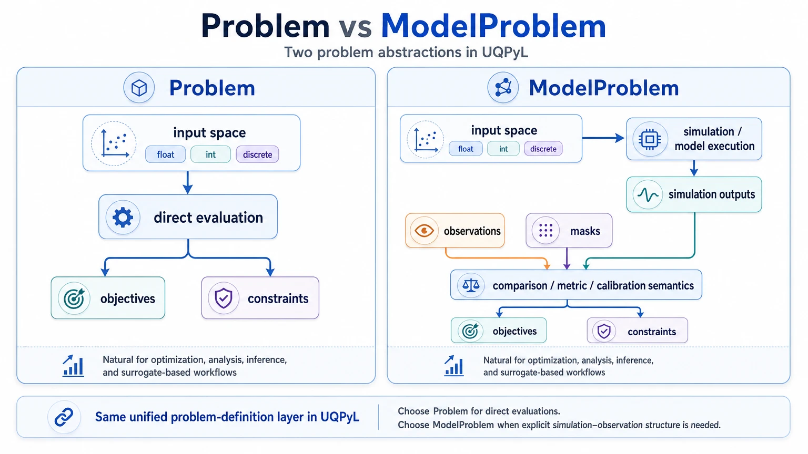
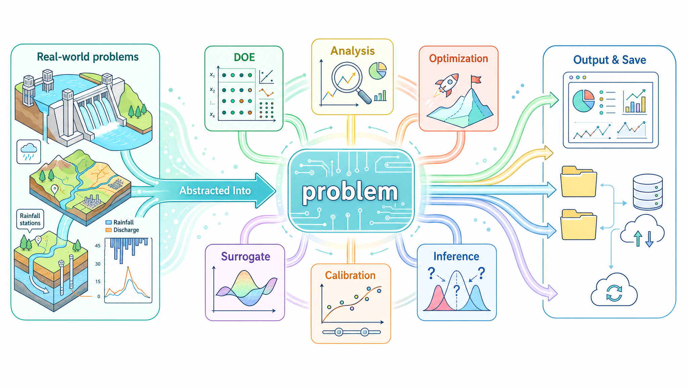

# UQPyL：Uncertainty Quantification Python Lab

<p align="center"></p>

[](https://badge.fury.io/py/UQPyL) [](https://github.com/smasky/UQPyL/actions/workflows/ci.yml) [](https://codecov.io/gh/smasky/UQPyL)     

[English](README.md) | [中文](README_CN.md) | [Documentation](https://uqpyl.readthedocs.io)

UQPyL 是一个面向不确定性量化、优化、推断、率定和代理建模的 Python 库。
它强调问题定义一次，然后在不同 UQ 工作流中复用。

## UQPyL 解决什么问题

UQPyL 面向计算建模中的不确定性问题：不确定参数如何影响输出、哪些输入最重要、如何利用观测对模型进行率定，以及如何搜索稳健或较优的决策。

这类工作流在各类基于模型的领域都很常见，尤其是在水文、水资源和水工程中。

| 任务 | 示例 | UQPyL 提供什么 |
|---|---|---|
| 探索参数空间 | 生成候选水文参数组合。 | 可复现的试验设计与采样方法。 |
| 理解输入影响 | 识别哪些参数主导流量、负荷或其他模型输出。 | 敏感性分析与不确定性分析方法。 |
| 搜索较优参数 | 率定模型参数或优化工程决策。 | 单目标、多目标和昂贵模型优化算法。 |
| 估计合理参数分布 | 在不确定性下采样参数分布。 | MCMC 风格推断方法。 |
| 率定模拟模型 | 将模拟序列与观测进行比较。 | 基于 `ModelProblem` 的率定方法。 |
| 降低高代价评估成本 | 为慢速模型建立更便宜的近似。 | 代理模型与代理辅助工作流。 |

## 核心思想：定义一次，到处复用

UQPyL 不直接持有你的模型逻辑，而是把模型或决策问题包装成统一的 `problem` 定义，其中包括：

| 部分 | 含义 |
|---|---|
| 输入空间 | 变量、边界、标签和变量类型。 |
| 评估规则 | 一批输入如何转换成目标、约束或提取想要的模拟数据。 |
| 优化方向 | 每个目标是最小化还是最大化。 |
| 运行信息 | 保存运行和结果摘要所用的问题名称与元数据。 |

一旦定义完成，同一个对象就可以被 DOE、分析、优化、推断、代理工作流和率定方法共同复用。有些工作流还需要更明确的模型语义，例如模拟结果或观测。

## Problem 抽象

`problem` 模块是理解 UQPyL 的概念入口。

| 抽象Python类 | 作用 |
|---|---|
| `Problem` | 适用于只需要最终目标值或约束值的方法。 |
| `ModelProblem` | 适用于需要显式模型模拟结果的方法，例如 `sim`或`obs` 。 |

这两个抽象共享同一套基础：

| 基础构件 | 作用 |
|---|---|
| `Space` | 定义变量、及其边界、标签和变量类型。 |
| `Eval` | 评估的返回对象。 |

该模块还内置了一些基准问题，如单目标的 `Sphere`、`Ackley`等；多目标的`ZDT` 和 `DTLZ`套件。

当方法只需要从候选输入获得最终目标或约束时，使用 `Problem`。因此，对于以数值模型为基础的问题，只要最终值已经足够，仍然可以使用 `Problem`。只有在方法明确需要模拟结果、观测或模拟与观测对比语义时，才使用 `ModelProblem`。在当前设计里，这主要对应Calibration模块(`IES`, `ES`, `GLUE`, `SUFI2`)。

<p align="center">
  
</p>

对于水文模型来说，难点通常不在算法本身，而在模型连接这一层。因此，我们强烈推荐使用 [hydroPilot](https://github.com/smasky/hydroPilot)来构建问题。

## 架构概览

UQPyL 围绕统一的 `problem` 抽象组织，并在其上构建一套功能模块。

<p align="center">
  
</p>

这张图概括了 UQPyL 的主线：把建模任务表示成统一的 `problem` 定义，然后在 DOE、分析、优化、推断、率定和代理建模工作流之间复用，并配套统一输出和可选的运行期存储。

| 类型 | 模块 | 作用 |
|---|---|---|
| Core | `problem` | 定义参数空间、评估规则、目标、约束、模拟及相关元数据。 |
| Function | `doe` | 为实验、分析、初始化和建模生成设计样本。 |
| Function | `analysis` | 分析输入变量如何影响模型或目标输出。 |
| Function | `optimization` | 搜索单目标、多目标或昂贵模型最优解。 |
| Function | `inference` | 执行 MCMC 风格参数推断。 |
| Function | `calibration` | 基于观测率定模拟模型。 |
| Function | `surrogate` | 为高代价评估训练与评估代理模型。 |

可视化、运行期存储、日志和 读取都通过这些功能模块接入。

## 典型工作流

常见工作流最终都会产出结构化结果，并可选配运行期存储。

```text
Problem -> DOE -> Analysis -> outputs
Problem -> Optimization -> outputs
Problem -> Inference -> outputs
ModelProblem -> Calibration -> outputs
Problem -> DOE -> Surrogate -> Optimization
```

## 快速开始示例

### 使用 `Problem` 做优化

```python
import numpy as np

from UQPyL.problem import Problem
from UQPyL.optimization.soea import SCE_UA


def objFunc(X):
    X = np.atleast_2d(X)
    return np.sum(X**2, axis=1, keepdims=True)


problem = Problem(
    nInput=2, nObj=1,
    ub=1.0, lb=-1.0,
    objFunc=objFunc, optType="min",
    name="Sphere2D",
)

algorithm = SCE_UA(maxFEs=200, verboseFlag=False, logFlag=False, saveFlag=False)

result = algorithm.run(problem, seed=123)

print(result.bestDecs)
print(result.bestObjs)
```

### 使用 `ModelProblem` 做率定

```python
import numpy as np

from UQPyL.calibration import GLUE
from UQPyL.problem import ModelProblem

obs = np.array([[1.0], [2.0], [3.0]])


def simFunc(X):
    X = np.atleast_2d(X)
    # 这里假设每组参数都会返回 1 条模拟序列，
    # 一共有 3 个时刻，因此返回尺寸是 (n_samples, 3, 1)。
    sim = np.zeros((X.shape[0], 3, 1))
    sim[:, 0, 0] = X[:, 0] * 1.0
    sim[:, 1, 0] = X[:, 0] * 2.0
    sim[:, 2, 0] = X[:, 0] * 3.0
    return sim


problem = ModelProblem(
    nInput=1, nObj=1,
    lb=0.0, ub=2.0,
    simFunc=simFunc, obs=obs,
    name="LinearScaleModel",
)

X = np.linspace(0.5, 1.5, 32).reshape(-1, 1)
result = GLUE(metric="rmse", verboseFlag=False).run(problem, X, threshold=0.2)
```

方法会返回结构化结果对象，例如 `OptResult`、`AnaResult`、`InfResult` 或 `CalResult`。

## 模块速览

| 目标 | 建议入口 |
|---|---|
| 对参数空间采样 | `doe` |
| 识别关键输入 | `analysis` |
| 搜索较优参数 | `optimization` with `SCE_UA` |
| 用观测率定模型参数 | `calibration` with `ModelProblem` |
| 为高代价模型建立快速近似 | `surrogate` |

| 模块 | 代表性方法 |
|---|---|
| `doe` | `LHS`、`FFD`、`Random`、`Sobol`、`SaltelliDesign`、`FASTDesign`、`MorrisDesign` |
| `analysis` | `Sobol`、`FAST`、`RBDFAST`、`Morris`、`RSA`、`DeltaTest`、`MARS` |
| `optimization` | `GA`、`PSO`、`DE`、`SCE_UA`、`NSGAII`、`NSGAIII`、`MOEAD`、`RVEA`、`EGO` |
| `inference` | `MH`、`AMH`、`MH_Gibbs`、`DEMC`、`DREAM_ZS` |
| `calibration` | `GLUE`、`SUFI2`、`ES`、`IES` |
| `surrogate` | `RBF`、`GPR`、`KRG`、`LinearRegression`、`PolynomialRegression`、`AutoTuner` |

对于很多单目标水文和工程率定问题，`SCE_UA` 是一个很好的起点。

## 运行输出与保存

大多数可运行方法都共享三个常见运行期控制选项。

| 选项 | 作用 |
|---|---|
| `verboseFlag` | 在终端打印进度和摘要。 |
| `logFlag` | 在支持时写出更完整的运行日志。 |
| `saveFlag` | 保存结构化结果，通常是 sqlite。 |

```python
algorithm = SCE_UA(maxFEs=200, verboseFlag=True, logFlag=True, saveFlag=True)
result = algorithm.run(problem, seed=123)
```

终端输出示例如下：

```text
Algorithm: SCE-UA
Problem: Sphere2D
nInput: 2
nObj: 1
maxFEs: 200
maxIters: 1000
SCE-UA | iter=10 eval=84 best=4.3210e-03 cv=0 time=0.0s
SCE-UA | iter=20 eval=154 best=2.1500e-04 cv=0 time=0.0s
Optimization finished
  algorithm        : SCE-UA
  status           : finished
  iterations       : 27
  evaluations      : 203
  best value       : 1.0000e-04
  best X           : [1.0000e-02, -0.0000e+00]
  constraint viol. : 0
  elapsed          : 0.0s
```

启用 `saveFlag=True`` 后，运行可以产出供对应 reader 后续读取的持久化结果。

| 保存选项 | 规则 |
|---|---|
| `saveFlag=True` | 为当前运行启用结构化结果保存。 |
| `saveFreq` | 对优化方法，会每隔 `saveFreq` 次迭代保存一次中间快照，并在结束时始终保存最终结果。 |
| Reader 读取 | 保存下来的 sqlite 结果后续可以通过 `OptReader`、`AnaReader`、`CalReader` 等模块 reader 读取。 |

## 更多示例

使用 `Sobol` 做敏感性分析：

```python
import numpy as np

from UQPyL.analysis import Sobol
from UQPyL.doe import SaltelliDesign
from UQPyL.problem import Problem


def objFunc(X):
    X = np.atleast_2d(X)
    y = np.sin(X[:, 0]) + 7 * np.sin(X[:, 1])**2 + 0.1 * X[:, 2]**4 * np.sin(X[:, 0])
    return y[:, None]


problem = Problem(
    nInput=3, nObj=1,
    lb=-np.pi, ub=np.pi,
    objFunc=objFunc, name="Ishigami",
)

X, meta = SaltelliDesign(secondOrder=True).sampleWithMeta(problem, 512)
Y = problem.evaluate(X, target="objs").objs
result = Sobol(verboseFlag=False).analyze(problem, X, Y, meta=meta, target="objs")
```

## 安装

UQPyL 需要 Python 3.8 或更高版本。

```bash
pip install -U UQPyL
```

如果需要绘图工具：

```bash
pip install -U "UQPyL[viz]"
```

从源码安装：

```bash
git clone https://github.com/smasky/UQPyL.git
cd UQPyL
pip install .
```

## 引用

UQPyL 2.x 的引用信息后续会更新。UQPyL 1.0 可参考：

- <https://www.sciencedirect.com/science/article/pii/S1364815215300955>

## 贡献

欢迎贡献。适合补充的方向包括新算法、模型接口、基准问题、示例、测试和文档改进。

## 许可证

UQPyL 基于 MIT License 发布。详见 [LICENSE.md](LICENSE.md)。
