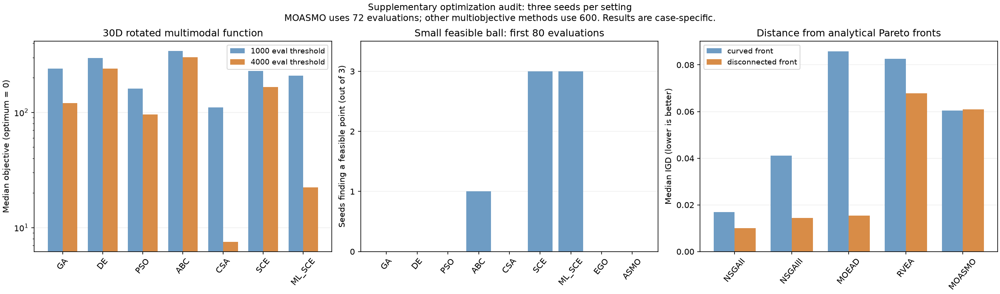

# 2026-10-02 优化模块扩展案例

## 结论

补充 **318 条记录（306 次算法运行 + 12 次均匀随机参照）**，涵盖全部 14 个优化器。评价次数、合法输入、参数/目标对应、约束优先、全评价最优保留和完整非支配档案检查均通过，未产生 warning。**没有新增可复现的逻辑错误**；但高维多峰精度、代理辅助约束引导和部分多目标搜索的覆盖仍有明确局限。

本轮只增加独立测试脚本、原始数据、图和记录，未修改生产算法或 pytest；未重复全仓测试。2880 passed 是上轮修复后的基线，不把它当成本轮新增案例的精度证明。未提交、推送或重建 wheel。

## 案例和验证范围

| 类别 | 配置 | 记录数 |
|---|---|---:|
| 高维与多峰 | 7 单目标算法 × 10/30维 × 旋转椭球/旋转多峰 × 1000/4000评价阈值 × 3种子 | 168 |
| 小可行域 | 7 单目标算法 + EGO/ASMO，两个球半径、3种子；EGO/ASMO另有可行初始点对照 | 66 |
| 随机参照 | 两半径 × 80/2500样本 × 3种子 | 12 |
| 多目标前沿 | NSGAII/NSGAIII/MOEAD/RVEA/MOASMO × 连续/不连通前沿 × 3种子 | 30 |
| 相同前80次评价 | 7 单目标算法 × 两半径 × 3种子，单独截取前80个真实评价点 | 42 |

种子为 5、17、41。全部运行禁用保存和终端输出，捕获并保留警告；没有把警告隐藏后计为正常。保留完整迭代预算规则，除“前80次”控制外，FEs 可略超阈值。检查保存的结果不是只看算法自报：用独立回调收集所有真实评价点，再重新计算函数/约束，核对单目标最好值；多目标逐点检查输出不被任何已评价可行点支配、全部已评价可行点均被返回档案弱支配。

### 1. 高维多峰：增加预算有效，但没有普遍达到全局最优

令 `z=(x-0.123)@Q`，`Q` 是固定 QR 正交矩阵，边界 `[-5,5]^d`。

- 椭球：`sum(w*z²)`，`w` 从 `1e-6` 等比到 1，条件数为 `1e6`。
- 多峰：`10*d + sum(z² - 10*cos(2*pi*z))`。
- 两者真实最优均为 `x=0.123`、目标 0。

84 对同种子/同配置的预算对照中，增加预算没有使已找到的最好值变差。下面为 **30维多峰** 的三个种子最终目标中位数：

| 算法 | 1000评价阈值 | 4000评价阈值 |
|---|---:|---:|
| GA | 239.53 | 120.35 |
| DE | 297.07 | 241.01 |
| PSO | 161.54 | 95.68 |
| ABC | 342.71 | 302.50 |
| CSA | 110.89 | 7.50 |
| SCE_UA | 228.30 | 166.20 |
| ML_SCE_UA | 208.53 | 22.32 |

30维该案例中没有一次达到目标 `<1e-3`；10维时 CSA 的三个种子达到此阈值，其他算法未达到。不能据三个种子、单个平移位置和旋转得出通用算法排名；特别是最优点靠近盒中心，可能影响不同搜索算子的相对表现。

单峰旋转椭球明显更容易。例如 30维、4000阈值，SCE_UA / CSA / ML_SCE_UA 的中位数约为 `4.44e-4 / 5.37e-4 / 1.24e-3`，而 ABC 约为 `0.599`。这是有限预算下的精度差别，没有发现已经评价的好解被丢弃。

高维组实际 FEs 为 1000–4257。不同算法初始化规模和末轮大小不同，不是严格等 FEs 比赛。

### 2. 小可行域：约束引导选点的短板得到具体证据

四维 `[0,1]^4`，最小化 `sum((x-.2)²)`，约束 `sum((x-.8)²)<=r²`。约束球完全位于盒内，半径分别 `.03` 和 `.15`，可行体积占比分别约 **0.00040% / 0.250%**。解析约束最优值为 `(1.2-r)²`。

- 7 个普通单目标算法在 **2500评价阈值**下，两半径、三个种子均找到可行解（42/42）。最窄球上 SCE/ML-SCE 的最优差距中位数约 `6.59e-13 / 1.15e-12`；其他算法也返回正确的已见最佳可行点，但精度不同。
- EGO/ASMO 在 **80次真实评价**、无可行初始点时，两半径均为 **0/3**；没有伪报可行。内层统一使用 GA（20成员、160评价阈值），代理为默认 KRG。这些预算和内层配置是本次实验选择，不代表所有配置。
- 提供球心 `.8` 作为一个可行初始点后，EGO/ASMO 均保留可行结果，但最终目标都停留在初始水平 `1.44`；两半径相对解析最优差距为 `.0711 / .3375`，说明“已有可行点”没有自动解决目标与约束冲突下的改进方向。

**不能直接拿 2500 次和 80 次作胜负比较。** 追加同为前80个真实评价点的控制：

| 算法 | 最窄球 r=.03：成功种子/3 | 较大球 r=.15：成功种子/3 |
|---|---:|---:|
| GA / DE / PSO / CSA | 各0/3 | 各0/3 |
| ABC | 0/3 | 1/3 |
| SCE_UA / ML_SCE_UA | 各0/3 | 各3/3 |
| EGO / ASMO | 各0/3 | 各0/3 |

所以最窄球上 80 次预算本身就不足以区分这些方法；较大球与可行初值控制才提供额外信息。初始种群规模仍按方法保留，前80次控制并非统一初始化的全面性能排名。均匀随机在最窄球的 80/2500 两档均 0/3；较大球分别 0/3 和 3/3。

结合现有 `constraintHandling="evaluation_only"` 实现，**C17 约束代理/可行性引导选点是明确值得改善的能力**。该项此前暂缓，本轮不擅自改变设计或把它说成新发现的公式 bug。

### 3. 多目标：档案正确不等于已经逼近真实前沿

六维问题，令 `t=x0`，`g=sum((x[1:]-.37)²)`，`f1=t²+g`，`f2=(1-t)²+g`。真实前沿为 `g=0`，`t∈[0,1]`；不连通版本要求 `t∈[.1,.25]∪[.75,.9]`，保留两个真实弧段。

使用解析前沿网格（连续1001点、不连通1002点），直接用 SciPy `cdist` 计算参考点到返回档案的平均最近距离，未调用待测库的 IGD。以下为三个种子的中位数：

| 算法 | 真实评价预算 | 连续前沿 IGD | 不连通前沿 IGD |
|---|---:|---:|---:|
| NSGAII | 600 | .01684 | .00999 |
| NSGAIII | 600 | .04110 | .01447 |
| MOEAD | 600 | .08582 | .01537 |
| RVEA | 600 | .08254 | .06787 |
| MOASMO | 72 | .06041 | .06089 |

所有不连通案例均覆盖两段，但 RVEA 的档案只有 9/4/11 个点，逼近较稀疏。MOASMO 的真实模型预算小得多，不能据此表宣布其差于其他算法。所有返回档案都正确保留已评价的非支配信息；差别来自本次搜索产生的候选覆盖，不是档案漏存。

## 后续建议

优先考虑此前暂缓的 **约束引导选点**，其影响已经由目标与约束冲突的明确案例复现。高维多峰搜索则先结合实际问题选择算法、预算和重启策略，不根据这组小规模基准统一改默认算法或参数。当前没有需要立刻修复的新逻辑缺陷。

## 复现与原始数据

- [脚本](verification/check_optimization_hard_cases.py)：在项目根目录设置 `PYTHONPATH=.`，使用 conda py312，分别传入 `dimension`、`narrow`、`front`、`matched`。推荐 `OPENBLAS_NUM_THREADS=1 OMP_NUM_THREADS=1`，使用 `python -W error`。
- [高维168条](verification/1002-optimization-hard-dimension.json)、[可行域及随机参照78条](verification/1002-optimization-hard-narrow.json)、[前沿30条](verification/1002-optimization-hard-front.json)、[前80次控制42条](verification/1002-optimization-hard-matched.json)。
- [汇总CSV](verification/1002-optimization-hard-summary.csv)、[PNG图](verification/1002-optimization-hard-cases.png)、[SVG图](verification/1002-optimization-hard-cases.svg)。图已检查，无文字截断。
- Ruff 和差异检查通过；未改动生产实现。
