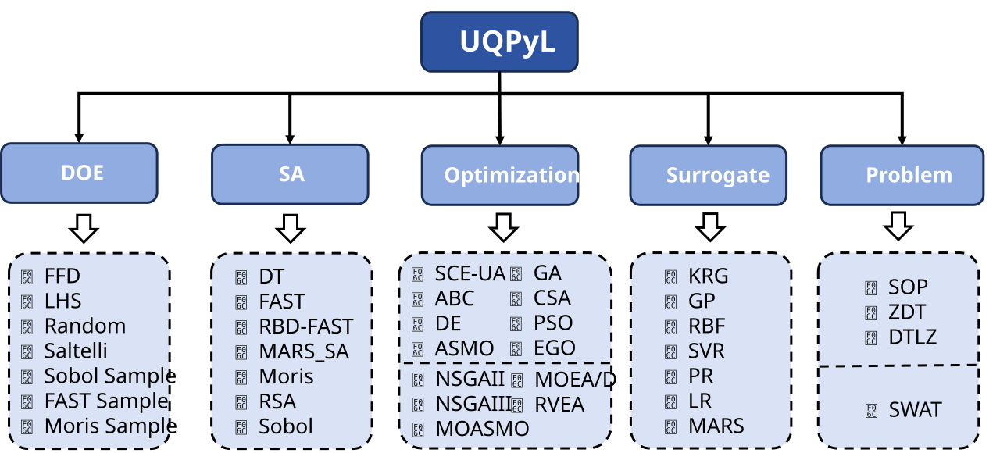
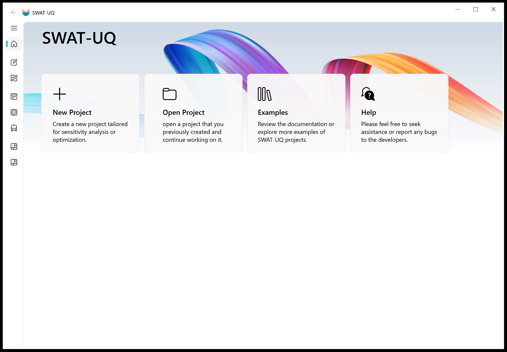

# Welcome to UQPyL documentation

<p align="center"></p>

[](https://badge.fury.io/py/UQPyL)     

**UQPyL** is a Python package for **Uncertainty Quantification** and **Optimization** of computational models and their associated problems (e.g., model calibration, resource scheduling, product design). It includes a wide range of methods and algorithms for Design of Experiments, Sensitivity Analysis, Optimization (Single- and Multi-objective). Additionally, **Surrogate Models** are built-in for solving computationally expensive problems.

---

## 🔗 Project Overview

- **Website**: [UQPyL Official Site](http://www.uq-pyl.com) (**TODO**: Needs update)
- **Source Code**: [GitHub Repository](https://github.com/smasky/UQPyL/)
- **PyPi Site:** [PyPi Site](https://pypi.org/project/UQPyL/)
- **Documentation**: [ReadTheDocs](https://uqpyl.readthedocs.io/en/latest/) (**TODO**: Being updating )
- **Citation Infos**: UQPyL 2.0(**TODO**: Needs update), [UQPyL 1.0](https://www.sciencedirect.com/science/article/pii/S1364815215300955)

---
## ✨ Main Features
1. **Comprehensive Sensitivity Analysis and Optimization**: Implements widely used sensitivity analysis methodologies and optimization algorithms.
2. **Running Display and Result Save**: Enable users to timely track and save the history and results of their running.
3. **Advanced Surrogate Modeling**: Integrates diverse surrogate models and auto-tunning tool to enhance these model performances.
4. **Rich Application Resources**: Provides a comprehensive suite of benchmark problems and practical case studies, enabling users to get started quickly. (👉**Recent Planing:** For water science research, we plan to customize the interface to integrate water-related models with UQPyL, enhancing usability and functionality, like [SWAT-UQ](https://github.com/smasky/SWAT-UQ). So, **if you have interest, please contact us to collaborate.**).
5. **Modular and Extensible Architecture**: Encourages and facilitates the development of novel methods or algorithms by users, aligning with our commitment to openness and collaboration. (**We appreciate and welcome contributions**)

---

## ⚙️ Installation

 

**Recommended (PyPi or Conda):**

```python
pip install -U UQPyL
```

```python
conda install UQPyL --upgrade
```

Alternatively:

```python
git clone https://github.com/smasky/UQPyL.git 
cd UQPyL
pip install .
```

## 🚀 Getting Started

-  [Quick Start](quick_start.md)
-  [Advancing](advancing.md)
-  [Tutorial](tutorial.md)
-  [Examples](examples.md)
-  [API Reference](api_reference.md)
-  [Changlog](chang_log.md)

---

## ⭐ UQ Project Series

- [UQPyL](https://github.com/smasky/UQPyL), a Python package for **Uncertainty Quantification** and **Parameter Optimization**.

<figure align="center">
  
  <figcaption>Overview of UQPyL</figcaption>
</figure>

- [SWAT-UQ](https://github.com/smasky/SWAT-UQ), providing script-based (Develop) and GUI versions to integrate UQPyL and the Soil and Water Assessment Tool (**SWAT**) model. 

<figure align="center">
  
  <figcaption>SWAT-UQ GUI Version</figcaption>
</figure>

---