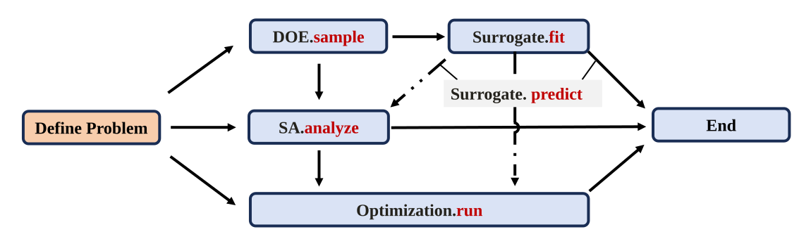

# Overview of UQPyL

---

**UQPyL** is a Python package that provides a comprehensive set of methods for supporting various workflows, including design of experiments, sensitivity analysis, optimization, data mining, and their integration. To facilitate these workflows, UQPyL is organized into several modules: a. **DoE** (Design of Experiments); b. **problems**; c. **sensibility**; d. **optimization**; e. **surrogates**. 

 

All methods and algorithms are implemented within a unified and consistent framework.
As a result, UQPyL enables the construction of complete workflows such as:

<figure align="center">
  
  <figcaption>Full Workflow of UQPyL</figcaption>
</figure>

First, users should define solved problem. This problem acts as a interface to UQPyL.

Once the problem is defined, users can proceed through a variety of workflows:

1. **Design of Experiments (DOE):** All sampling methods contain `sample` function. So using `DoE.sample()` efficiently explore the input space and generate data for analysis or modeling.

2. **Surrogate Modelling:** Based on the sampled data, surrogate models (e.g., polynomial regression, Gaussian processes ...) can be trained by `Surrogate.fit()`. These models provide fast approximations of the original, potentially expensive simulations.

3. **Sensitivity analysis:** `SA.analyze()` can quantify the impact of input variables on the outputs. It can either use the original model evaluations or the trained surrogate model via `Surrogate.predict()` for efficiency.

4. **Optimization:** With the original model or surrogate in place, optimization tasks can be carried out by `Optimization.run()`, enabling design improvement or calibration.

5. **Integration:** These modules are seamlessly connected. For practical problems, the entire workflow -- "DoE->Sensibility Analysis->Optimization" can be carried out within UQPyL. Additionally, surrogate models can be employed to accelerate both sensitivity analysis and optimization processes.

💡**Note:**  For detailed usage examples, please refer to [example collections](./examples.md) page provided in this documentation.