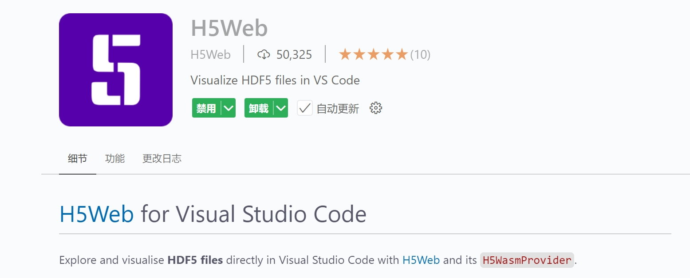

# Sensitivity Analysis

---

## 🍍 What is the Sensitivity Analysis?

**Sensitivity Analysis** is widely used to determine how different input variables influence the output of a model. It helps identify which inputs have the most significant impact on the results, providing valuable insights for **model optimization**, **uncertainty quantification**, and **decision-making**. By systematically varying inputs and observing changes in the output, the behavior of complex systems can be better understood.


## 🥭 Overview of `UQPyL.sensibility`

The `sensibility` module of UQPyL provide comprehensive methods, including:

| Abbreviation | Full Name | References |
| -------|------------|----------|
| Sobol' | \ |[Sobol(2010)](https://www.sciencedirect.com/science/article/pii/S0378475400002706), [Saltelli (2002)](https://www.sciencedirect.com/science/article/pii/S0010465502002801)|
| DT| Delta Test| [Eirola et al. (2008)](https://www.semanticscholar.org/paper/Using-the-Delta-Test-for-Variable-Selection-Eirola-Liiti%C3%A4inen/fa131898bbd99e848e706837f4072a310e1109e5?p2df)|
| FAST | Fourier Amplitude Sensitivity Test | [Cukier et al. (1973)](https://pubs.aip.org/aip/jcp/article-abstract/59/8/3873/533535/Study-of-the-sensitivity-of-coupled-reaction), [Saltelli et al. (1999)](https://amstat.tandfonline.com/doi/abs/10.1080/00401706.1999.10485594)|
| RBD-FAST| Random Balance Designs Fourier Amplitude Sensitivity Test | [Tarantola et al. (2006)](https://www.sciencedirect.com/science/article/pii/S0951832005001444), [Tissot, Prieur (2012)](https://www.sciencedirect.com/science/article/pii/S0951832012001159)
|MARS-SA|  Multivariate Adaptive Regression Splines for Sensibility Analysis |[Friedman, (1991)](https://projecteuclid.org/journals/annals-of-statistics/volume-19/issue-1/Multivariate-Adaptive-Regression-Splines/10.1214/aos/1176347963.full)|
|Morris| \ |[Morris, (2012)](https://www.tandfonline.com/doi/abs/10.1080/00401706.1991.10484804)|
|RSA| Regional Sensitivity Analysis | [Hornberger, Spear, (1981)](https://www.osti.gov/biblio/6396608), [Pianosi (2016)](https://www.sciencedirect.com/science/article/pii/S1364815216300287) |  


All the methods above inherit from the `saABC` class in `UQPyL.sensibility`. The `sample` and `analysis` functions are predefined and fixed for these methods. In addition, UQPyL provide the `Result` class to integrate all useful information during analysis.

<br>

Here, we introduce their API reference:

**Class `saABC`:**

```
The saABC is the base class of methods from UQPyL.sensibility, which has two predefined and fixed functions, `sample` and `analysis`. 

```

**Constructor:**

```
__init__

- Description:

Initializes a new instance of SA methods.

Note: The hyper-parameters are categorized into two parts: a. fixed parameters for all methods; b. special parameters.

- Fixed Parameters for all methods:
    - scalers(tuple(Scaler, Scaler)): A Python tuple specifying the scalers to be used for normalization. If provided, the method will normalize the input `X` and output `Y` during analysis. Each `Scaler` should be an instance of the class from `UQPyL.utility`. `scalers[0]` is used for normalizing `X`, and `scalers[1]` is used for normalizing `Y`.

    - verboseFlag(bool): If set to `True`, the method will output detailed logs or progress messages during execution. Useful for debugging or tracking the analysis process. Default: True.

    - saveFlag(bool): If set to `True`, the analysis result would be saved to `./Result/Data`. Default: False.

    - logFlag(bool): If set to `True`, the verbose result would be simultaneously saved to `./Result/Log`. Default: False.

Other hyper-parameters vary between different SA methods. Please refer to each specific method for details.

For example, FAST can define `M`, i.e., the number of harmonics to sum in the Fourier series decomposition. Default 4.
```

**Methods:**

```
sample

- Description:

Generate samples from the decision space.

Same as the `sample` in DoE, but here to support methods with specific sampling requirements.

- Parameters:
    - problem(Problem) : This must be specified.

Other parameters vary between different methods, please check API reference.

- Return:
    - np.2darray : A 2D Numpy Array of generated array.
```

```
analyze

- Description:
    Perform sensitivity analysis based on input X and output Y with the problem

- Parameters:
    - problem(Problem) : A instance of Problem. This must be specified.
    - X(np.2darray) : A 2D Numpy array of decisions.
    - Y(np.2darray) : Optional, If not provided, would be evaluated by the problem.

- Returns:
    - res(Result) : A Class that containing useful information about analysis.
```

---

**Class `Result`:**

It is used to store and manage the results of sensitivity analysis.

<br>

**Attributes:**

```
- Si(dict) : A Python dictionary storing analysis results with fixed keywords:
       - 'S1' for first-order sensitivity indices
       - 'S2' for second-order sensitivity indices
       - 'ST' for total-order sensitivity indices

- labels(list) : A python list store the name of variables.

- firstOrder(bool) : If True, the Si contains `S1`.

- secondOrder(bool) : If True, the Si contains `S2`.

- totalOrder(bool) : If True,  the Si contains `ST`.
```

## 🍌 How to perform sensitivity analysis?

Take Ishigami Function as example.
<p align="center"></p>

The theoretical sensitivity indices of the Ishigami function are as follows:

First-order sensitivity indices: x1 = 0.314, x2 = 0.442, x3 = 0.000

Total-order sensitivity indices: x1 = 0.558, x2 = 0.442, x3 = 0.244

```python

# Step 1: Define problem

from UQPyL.problems import Problem

def objFunc(X):
    objs = np.sin(X[:, 0]) + 7 * np.sin(X[:, 1])**2 + \
                 0.1 * X[:, 2]**4 * np.sin(X[:, 0])
    return objs[:, None]

Ishigami = Problem(nInput = 3, nOutput = 1, objFunc = objFunc,
                    ub = np.pi, lb = -1*np.pi, varType = [0, 0, 0],
                    name = "Ishigami")

# Step 2: Create a instance of sa methods

from UQPyL.sensibility import FAST

fast = FAST(
            verboseFlag = True,  # Display analysis process in terminal
            saveFlag = True, # Save results to Result/Data Folder
            logFlag = True # Save verbose content to Result/Log Folder
            )

# Step 3: Generate samples

X = fast.sample(problem = problem, N = 500)

# Optional. If not given, `problem.objFunc` would be used in `SA.analyze`
Y = problem.objFunc(X) 

res = fast.analyze(problem = problem, X = X, Y = Y)

print(res)
```

## 🍉 Check the result of sensitivity analysis (.hdf)

When creating an instance of a sensitivity analysis (SA) method, setting the `saveFlag` or `logFlag` to `True` will trigger automatic saving of the results to specific folders — either 'Result/Data' or 'Result/Log'.

The output file containing the analysis results is named following the format `A_B_I.hdf`, where: where: A denotes the name of the SA method used; B represents the name of the problem being analyzed; I is the index indicating the iteration or repetition of the same analysis.

For example, a file named 'FAST_Ishigami_3.hdf' refers to the third execution of the FAST method on the Ishigami function.

To visualize the results, we recommend installing H5Web, a VSCode extension that allows interactive viewing of HDF5 files directly within the editor.

<figure align="center">
  
  <figcaption>H5Web in VSCode</figcaption>
</figure>