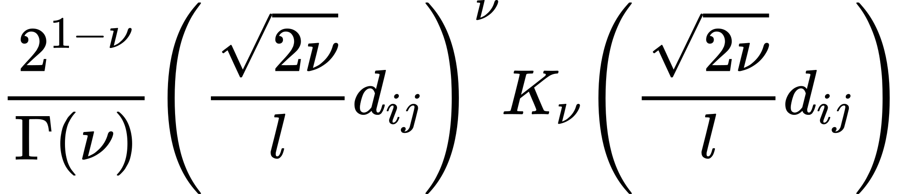
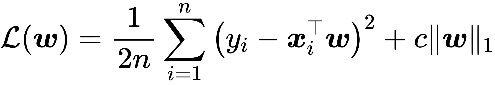
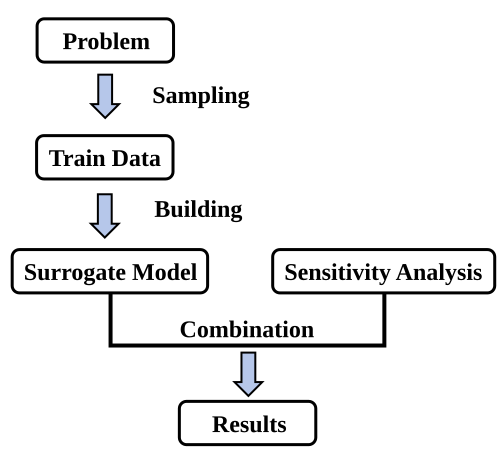
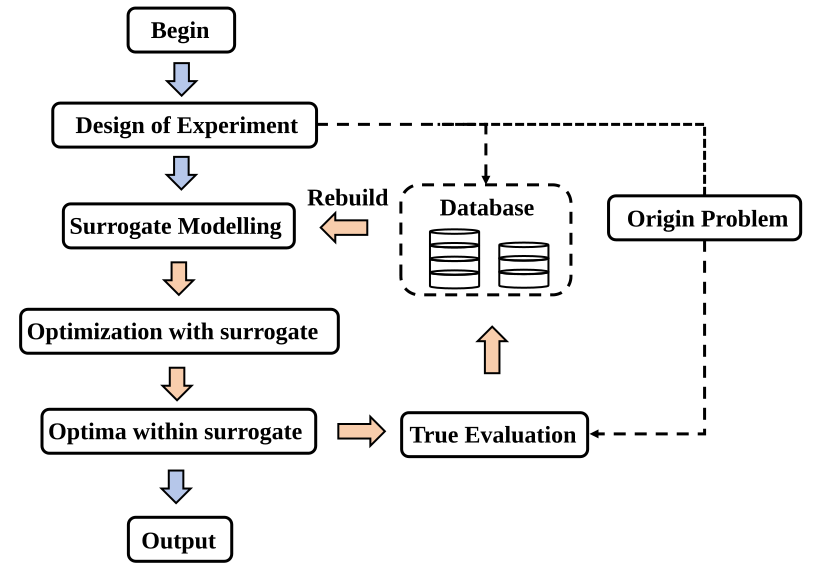

# Surrogate Models

---

## What is the Surrogate Model

**Surrogate Model** is the approximate model used to mimic the behavior of a more complex and expensive-to-evaluate function or model. In sensitivity analysis and optimization, surrogate models are often employed to reduce the number of costly evaluations (e.g., simulations, real-world experiments) by providing fast predictions of objective or constraint values. 

Surrogate models include Gaussian Processes (or called Kriging), Radial Basis Function Networks (RBF), Support Vector Regression (SVR), and so on. The common characteristics are:

- **Fast prediction speed** – once trained, surrogate models can evaluate new inputs quickly compared to the original expensive function.

- **Good approximation capability** – they can capture complex, nonlinear relationships from a limited set of data samples.

- **Uncertainty estimation** – some models (Kriging) provide not only predictions but also confidence intervals, which is useful for exploration-exploitation trade-offs in optimization.

Overall, surrogate models show great potential in expensive-to-evaluate problems. And involving surrogate modelling has become the most distinctive and important features of UQPyL.

## Overview of `UQPyL.surrogates`

The `surrogates` module provides a collection of carefully implemented surrogate models designed to seamlessly support sensitivity analysis and parameter optimization tasks:

| Abbreviation | Full Name | Features |
|--------------|-----------|----------|
| KRG | Kriging | Support `guass`, `cubic`, `exp` kernel functions |
| GP | Gaussian Process | Support `const`, `rbf`, `dot`, `matern`, `rq` kernel functions |
| LR | Linear Regression | Support `origin`, `ridge`, `lasso` loss functions|
| PR | Polynomial Regression | Support `origin`, `ridge`, `lasso` loss functions|
| RBF | Radial Basis Function |Support `cubic`, `guass`, `linear`, `mq`, `tps` kernel functions and their corresponding hyper-parameters|
| SVM | Support Vector Machine | Use [libsvm](https://www.csie.ntu.edu.tw/~cjlin/libsvm/) as the core library |
| MARS | Multivariate Adaptive Regression Splines | Use [Earth](http://www.milbo.users.sonic.net/earth/) package as the core library |

All models above inherits from the `surrogateABC` class. In this class, the `fit` and `predict` functions are fixed. Now, we give its API reference:


**class `surrogateABC`:**
```
__init__

- Description:

Initializes a surrogate model.

Note: there also exist two parts of hyper-parameters: fixed and special parameters.

- Fixed parameters for all models:
    - scalers (Tuple(Scaler, Scaler)) : A Python tuple specifying the scalers to be used for normalization. If provided, the method will normalize the input `X` and output `Y` during analysis. Each `Scaler` should be an instance of the class from `UQPyL.utility`. `scalers[0]` is used for normalizing `X`, and `scalers[1]` is used for normalizing `Y`.

    - polyFeature (PolynomialFeatures) : A class from UQPyL.utility, used to perform polynomial transform to `X`.

Other hyper-parameters vary between different models. Please check API reference.
```

**Method**

```
fit

- Description:
Accepts training data to build the surrogate model. This method fits the model to the given inputs and corresponding outputs, allowing it to approximate the underlying function or model.

- Parameters:
    - xTrain(np.2darray) : A 2D Numpy array for input decisions
    - yTrain(np.2darray) : A 2D Numpy array for output values corresponding to each decisions. `Y` should have only one column, although `Y` belong to 2D Numpy.
```

```
predict

- Description:
Accepts input data `X` and returns the predicted output values based on the trained surrogate model.

- Parameters:  
  - xPred(np.ndarray):  
    A 2D NumPy array of shape (n_samples, n_features), where each row represents an input sample for which predictions are to be made.

- Returns:  
  - `np.ndarray`:  
    A 2D NumPy array of shape (n_samples, 1), containing the predicted output values corresponding to each input sample in `X`.
```

## How to import surrogate model

Each surrogate model in UQPyL is implemented in a separate submodule for better modularity and ease of use.

<br>

Take the Radial Basis Function as example:
```python
# Import the Radial Basis Function surrogate model
from UQPyL.surrogates.rbf import RBF

# Import the Cubic kernel used by the RBF model
from UQPyL.surrogates.rbf.kernel import Cubic
# Optional kernels: Cubic, Guassian, Linear, Multiquadric, ThinPlateSpline

# Create an instance of the RBF surrogate model with the Cubic kernel
rbf = RBF(kernel = Cubic())

# Note: `Cubic` is a Python class and must be instantiated before being passed as a kernel
```

💡 **Noted:** Except RBF model, the Gaussian Process, Kriging model also contain kernel functions. And the usage of these kernel are same with RBF model. Each kernel class contain hyper-parameters, please check API reference.

## Fitting and predicting with surrogate models

Use an RBF model with a cubic kernel to predict the output of the Sphere function.

```python
from UQPyL.problems.single_objective import Sphere

# Define the problem: Sphere function with 15 inputs
problem = Sphere(nInput = 15, ub = 100, lb = -100)

# Generate training data using Latin Hypercube Sampling (LHS)
from UQPyL.DoE import LHS
lhs = LHS()

# 300 training samples
trainX = lhs.sample(nt = 300, problem = problem)

# Evaluate training outputs
trainY = problem.objFunc(trainX)

# Generate testing data
predictX = lhs.sample(nt = 50, problem = problem)

# Create and configure the RBF surrogate model
from UQPyL.surrogates.rbf import RBF
from UQPyL.surrogate.rbf.kernel import Cubic

# Instantiate a Cubic kernel
kernel = Cubic()

# Instantiate RBF model with Cubic kernel
model = RBF(kernel = kernel)

# Train the surrogate model
model.fit(trainX, trainY)

# Predict outputs for new inputs
predictY = model.predict(predictX)

# Evaluate model performance using R² metric
from UQPyL.utility.metric import R_square

R2 = R_square(trainY, predictY)

print(R2)
```

## Use auto-tuner tool to build the surrogate model

The construction of surrogate models is a crucial step prior to their deployment. To facilitate this, UQPyL offers an auto-tuning utility named `AutoTuner`, available in the `UQPyL.surrogates` module. This tool assists in identifying optimal hyperparameter settings for surrogate models.


`AutoTuner` supports two search strategies for identifying hyper-parameters:

- **Grid Search**  
   This method evaluates all possible combinations of specified hyper-parameters.  
   It is simple, reliable, and time-efficient for small search spaces, but it may not always locate the global optimum.

- **Evolution Search**  
   This approach uses evolutionary algorithms to explore the hyperparameter space.  
   It is more suitable for complex or large search spaces and has a higher chance of finding global optima. However, it can be computationally more demanding than Grid Search.

### Grid search

Here's an introduction of building a Gaussian Process with a Matérn kernel.

Gaussian Process (GP) is a widely used machine learning model that provides both the mean and standard deviation of its predictions, offering a measure of uncertainty. At the heart of a GP lies the kernel function, which defines the model’s behavior by encoding assumptions about the function being learned. One commonly used kernel is the Matérn kernel, expressed as:

<figure align="center">
  
  <figcaption>Matérn Kernel</figcaption>
</figure>

Here, $d_{ij}$ denotes the distance between Point $i$ and Point $j$, $K_\nu$ denotes the Modified Bessel Function of the Second Kind. $\Gamma(\nu)$ means Gamma function

The kernel includes several hyper-parameters:

- $\nu$ - smoothness parameter, belong to {0.5, 1.5, 2.5, np.inf}
- $l$ - length scale

In addition, Gaussian Process contains a hyperparameter `C` that is added to the kernel matrix to help control the model's smoothness and numerical stability.

Here, we give a example of using GP with Matérn kernel to approximate Sphere function.

```python
# Step 1: Prepare training and testing data
import numpy as np
from UQPyL.problems.single_objective import Sphere
from UQPyL.DoE import LHS

# Define the optimization problem (Sphere function with 10 input dimensions)
problem = Sphere(nInput=10)

# Initialize Latin Hypercube Sampling (LHS) for design of experiments
lhs = LHS()

# Generate training samples and evaluate the objective function
trainX = lhs.sample(nt=300, problem=problem)
trainY = problem.objFunc(trainX)

# Generate testing samples and evaluate the objective function
testX = lhs.sample(nt=50, problem=problem)
testY = problem.objFunc(testX)

# Step 2: Initialize a Gaussian Process model with a Matérn kernel
from UQPyL.surrogates.gp import GPR
from UQPyL.surrogates.gp.kernel import Matern

# Create a Matérn kernel instance
kernel = Matern()

# Create a GP regression model using the specified kernel
gpr = GPR(kernel=kernel)

# Step 3: Retrieve the list of tunable hyperparameters
nameList = gpr.getParaList()  # Returns a list like ['c', 'l', 'nu']

# Step 4: Define a hyperparameter grid for tuning
# 'c' controls smoothness and numerical stability
# 'l' is the length scale parameter
# 'nu' controls the smoothness of the Matérn kernel
paraGrid = {
    'c': [1e-6, 1e-8, 1e-10, 1e-12],
    'l': [1, 1e1, 1e2, 1e3, 1e4, 1e5],
    'nu': [0.5, 1.5, 2.5, np.inf]
}

# Step 5: Create an AutoTuner to optimize the model's hyperparameters
from UQPyL.surrogates import AutoTuner

# Pass the GP model to the tuner
autoTuner = AutoTuner(surrogate=gpr)

# Step 6: Perform grid search to tune hyperparameters using training data
autoTuner.gridTune(trainX, trainY, paraGrid=paraGrid)

# Step 7: Train the GP model with the best-found hyperparameters
gpr.fit(trainX, trainY)

# Step 8: Make predictions on the test data
predictY = gpr.predict(testX)

# Step 9: Evaluate model performance using R-squared metric
from UQPyL.utility.metric import R_square

R2 = R_square(testY, predictY)

print(R2)
```

### Evolution search

Take Linear Regression(LR) to show how to use evolution search.

Linear Regression(LR) is also common used to model the linear relationship between input features and objective value. It works by finding the best weights to approximate through the data, typically by minimizing the loss function. In UQPyL, there are three types of loss functions: a. Classic; b. Ridge; c. Lasso. 

We apply the `Lasso` loss function:

<figure align="center">
  
  <figcaption>Lasso loss function</figcaption>
</figure>

Here, the $n$ denotes the number of training samples; $w$ denotes the weight vector to features.

The hyper-parameter is :

- $c$ : The regularization parameter that controls the strength of the L1 penalty. A larger $c$ encourages more coefficients to shrink to zero, promoting sparsity in the model.

We give a code example of using LR with Lasso loss function to approximate Sphere function.

```python
# Step 1: Prepare training and testing data
import numpy as np
from UQPyL.problems.single_objective import Sphere
from UQPyL.DoE import LHS

# Define the optimization problem (Sphere function with 10 input dimensions)
problem = Sphere(nInput=10)

# Initialize Latin Hypercube Sampling (LHS) for design of experiments
lhs = LHS()

# Generate training data and evaluate the objective function
trainX = lhs.sample(nt=300, problem=problem)
trainY = problem.objFunc(trainX)

# Generate testing data and evaluate the objective function
testX = lhs.sample(nt=50, problem=problem)
testY = problem.objFunc(testX)

# Step 2: Initialize a Linear Regression model with Lasso regularization
from UQPyL.surrogates.regression import LinearRegression

# 'C' is the regularization strength; 'C_attr' defines its bounds, type, and scaling (logarithmic)
lr = LinearRegression(
    lossType='Lasso',
    C=10,
    C_attr={'ub': 100, 'lb': 1e-5, 'type': 'float', 'log': True}
)

# Step 3: Retrieve the list of tunable hyperparameters
nameList = lr.getParaList()  # Typically returns something like ['c']

# Step 4: Create an AutoTuner to optimize the model’s hyperparameters
from UQPyL.surrogates import AutoTuner
from UQPyL.optimization.single_objective import GA

# Initialize Genetic Algorithm (GA) optimizer
ga = GA(nPop=50, maxFEs=10000, verboseFlag=False)

# Create the AutoTuner with the regression model and optimizer
autoTuner = AutoTuner(surrogate=lr, optimizer=ga)

# Automatically tune hyperparameters using the training data
autoTuner.opTune(trainX, trainY, nameList)

# Train the final model using the (possibly tuned) hyperparameters
lr.fit(trainX, trainY)

# Step 5: Make predictions on the testing data
predictY = lr.predict(testX)

# Step 6: Evaluate model performance using the R-squared metric
from UQPyL.utility.metric import R_square

R2 = R_square(testY, predictY)

# Print R-squared score
print(R2)

```

## Sensitivity analysis with surrogate models

For computationally expensive problems, performing common sensitivity analysis would be time-consuming, due to the need for thousands of decision evaluations. However, with assisting of surrogate model, the computational burden can be significantly reduced to an acceptable level.

Below is an example of conducting sensitivity analysis using a surrogate model.

Still take this problem as benchmark:

<p align="center"></p>

and assume that the function $\sin \left ( x_1 \right ) + a\cdot \sin^2 \left ( x_2 \right ) + b \cdot x_3^4\cdot \sin\left ( x_1 \right )$ is computationally expensive to evaluate.

The framework can be:

<figure align="center">
  
  <figcaption>The framework to sensitivity analysis with surrogate models</figcaption>
</figure>

In this framework, expensive evaluations of the true model occur only during the sampling phase, which is entirely controlled by the user.  

Afterward, the surrogate model can be coupled with sensitivity analysis. This process is theoretically negligible in computational cost.

Code Example:
```python

# Step 1: Define the problem

from UQPyL.problems import Problem

def objFunc(X):
    objs = np.sin(X[:, 0]) + 7 * np.sin(X[:, 1])**2 + \
           0.1 * X[:, 2]**4 * np.sin(X[:, 0])
    return objs[:, None]

Ishigami = Problem(nInput=3, nOutput=1, objFunc=objFunc,
                   ub=np.pi, lb=-np.pi, varType=[0, 0, 0],
                   name="Ishigami")

# Step 2: Generate training data for surrogate model

from UQPyL.DoE import LHS

lhs = LHS()
X = lhs.sample(nt=100, problem=Ishigami)
Y = Ishigami.objFunc(X)

# Step 3: Construct and train the surrogate model

# Using Radial Basis Function (RBF) surrogate model
from UQPyL.surrogates.rbf import RBF

rbf = RBF()  # Use default configuration
rbf.fit(X, Y)

# Step 4: Reconstruct the problem using the surrogate model

# Replace the original objective function with the surrogate's prediction function
problem_ = Problem(nInput=3, nOutput=1, objFunc=rbf.predict,
                   ub=np.pi, lb=-np.pi, varType=[0, 0, 0],
                   name="Ishigami")

# Step 5: Perform sensitivity analysis using the surrogate model

from UQPyL.sensibility import FAST

fast = FAST()

X_ = fast.sample(problem=problem_)
Y_ = problem_.objFunc(X_)  # Surrogate model (`rbf.predict`) is evaluated here

res = fast.analyze(X = X_, Y = Y_)
print(res)

```

## Single-objective optimization with surrogate models

Optimization algorithms have proven effective in solving a wide range of problems. Most research on these methods assumes that evaluating objective or constraint functions is inexpensive and near-instantaneous. However, this assumption does not suitable for many real-world applications, particularly those involving simulation-based or physical experiment-based evaluations.

To address this challenge, surrogate-assisted optimization algorithms have been developed.  
Our team has published several works focused on solving expensive optimization problems, including: [ASMO (2014)](https://www.sciencedirect.com/science/article/pii/S1364815214001698), [ASMO-PODE (2017)](https://www.sciencedirect.com/science/article/pii/S1364815216310830), [AMSMO (2023)](https://www.sciencedirect.com/science/article/pii/S0020025523008939) ... 

As an example, we use ASMO to demonstrate how surrogate models assist the optimization. Its framework is shown blew:

<figure align="center">
  
  <figcaption>The framework of ASMO</figcaption>
</figure>

The process begins with a Design of Experiment (DoE) to sample initial solutions, which are then evaluated on the original expensive problem and stored in a database. Based on this data, a surrogate model is constructed to approximate the true objective function. Optimization is then performed using the surrogate model, which is computationally cheap. The best solutions found in the surrogate space are subjected to true evaluation on the original problem. **These evaluated results are used to update the database, and the surrogate model is reconstructed accordingly**. This iterative loop continues until a termination criterion is met, after which the final output is reported. The framework significantly reduces the number of expensive evaluations by leveraging the surrogate model throughout the optimization process.

Overall, within this framework, the well-trained surrogate model would be coupled with the optimization algorithm. In addition, the surrogate model would be iteratively rebuilt, effectively avoiding potential accuracy issues.

Unlike the original [ASMO (2014)](https://www.sciencedirect.com/science/article/pii/S1364815214001698), the ASMO implemented in UQPyL serves as a fundamental and general-purpose surrogate-assisted optimization framework that supports various surrogate models and optimization algorithms.

Code Example for combining RBF model and GA within ASMO framework:
```python
# Step 1: Define the Sphere problem (assumed to be computationally expensive)
from UQPyL.problems.single_objective import Sphere
problem = Sphere(nInput=10)

# Step 2: Instantiate the RBF surrogate model
from UQPyL.surrogates.rbf import RBF
rbf = RBF()

# Step 3: Instantiate the Genetic Algorithm (GA) optimizer
from UQPyL.optimization.single_objective import GA
ga = GA(nPop=50, maxFEs=10000, verboseFlag=False)

# Step 4: Import the ASMO framework and initialize it with the surrogate and optimizer
from UQPyL.optimization.single_objective import ASMO
asmo = ASMO(surrogate=rbf, optimizer=ga, saveFlag = True)

# Step 5: Run the ASMO framework on the problem and retrieve the result
res = asmo.run(problem=problem)

```

## Multi-objective optimization with surrogate models

The framework of multi-objective optimization with surrogate models, named MO-ASMO, is similar with **ASMO**. But for multiple objectives, MO-ASMO would train a surrogate model for each objective.

Code Example for combining RBF, KRG model and NSGAII within MO-ASMO framework:

```python

# Step 1: Define the ZDT1 problem (assumed to be computationally expensive)
from UQPyL.optimization.multi_objective import ZDT1
zdt1 = ZDT1()

# Step 2: Instantiate surrogate models to be used
from UQPyL.surrogates.rbf import RBF
rbf = RBF()

from UQPyL.surrogates.kriging import KRG
krg = KRG()

# Step 3: Combine multiple surrogate models using the MultiSurrogates class
from UQPyL.surrogates import MultiSurrogates
surrogates = MultiSurrogates(n_surrogates=2, models_list=[rbf, krg])

# Step 4: Instantiate the NSGA-II optimizer
from UQPyL.optimization.multi_objective import NSGAII
nsgaii = NSGAII(nPop=50, maxFEs=10000, verboseFlag=False)

# Step 5: Import the MOASMO framework and initialize it with the surrogate models and optimizer
from UQPyL.optimization.multi_objective import MOASMO
moasmo = MOASMO(surrogates=surrogates, optimizer=nsgaii, saveFlag = True)

# Step 6: Run the MOASMO framework on the problem
moasmo.run(problem=zdt1)

```


